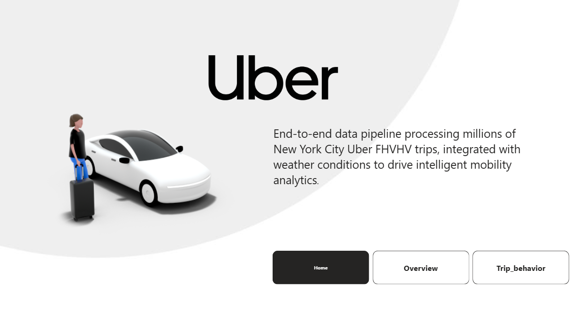
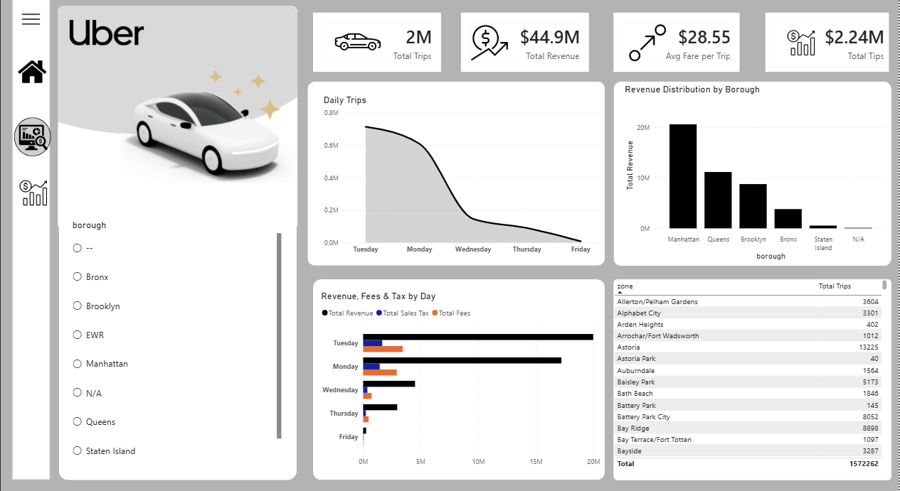
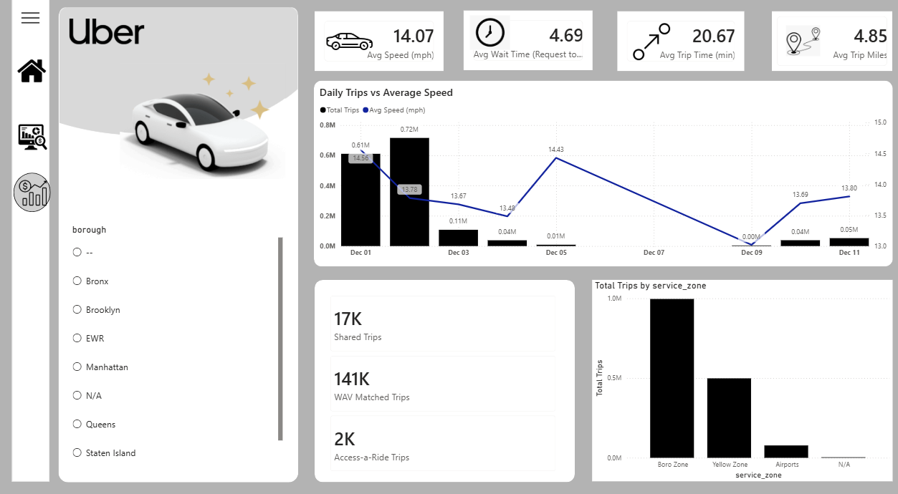

# Uber Trip Analytics Dashboard
 
An end-to-end data pipeline and interactive dashboard analyzing millions of New York City Uber (FHVHV) trips, enriched with weather data to surface mobility and demand insights.
 

 
##  Overview
 
This project processes and visualizes large-scale NYC For-Hire Vehicle High-Volume (FHVHV) trip records, combining them with weather conditions to power an interactive analytics dashboard. It's built to answer questions like:
 
- How do trips, revenue, and fares trend day to day?
- Which boroughs and zones generate the most demand and revenue?
- How does trip behavior (speed, wait time, trip duration) vary across the city?
- How much of the demand comes from shared rides, WAV (wheelchair-accessible vehicle) trips, and Access-a-Ride?
## Features
 
The dashboard is organized into multiple pages:
 
###  Home
Landing page with project navigation to **Overview** and **Trip Behavior** sections.
 
### Overview
High-level KPIs and revenue breakdowns:
- **2M** Total Trips
- **$44.9M** Total Revenue
- **$28.55** Avg Fare per Trip
- **$2.24M** Total Tips
- Daily trip volume trend
- Revenue distribution by borough (Manhattan, Queens, Brooklyn, Bronx, Staten Island)
- Revenue, fees & tax breakdown by day
- Trip counts by pickup zone (searchable/filterable table)

 
### Trip Behavior
Operational and service-level metrics:
- **14.07 mph** Avg Speed
- **4.69 min** Avg Wait Time (request to pickup)
- **20.67 min** Avg Trip Time
- **4.85 mi** Avg Trip Miles
- Daily trips vs. average speed trend
- Shared Trips, WAV Matched Trips, and Access-a-Ride Trips totals
- Total trips by service zone (Boro Zone, Yellow Zone, Airports, N/A)

 
### 🔍 Filtering
All pages support filtering by **borough** (Bronx, Brooklyn, EWR, Manhattan, N/A, Queens, Staten Island) for drill-down analysis.

🔗 [Uber NYC FHVHV Analytics – Google Drive](https://drive.google.com/drive/folders/1MfzxGp51vVwR7SGRywDeq3kTCg8ISdSN)

