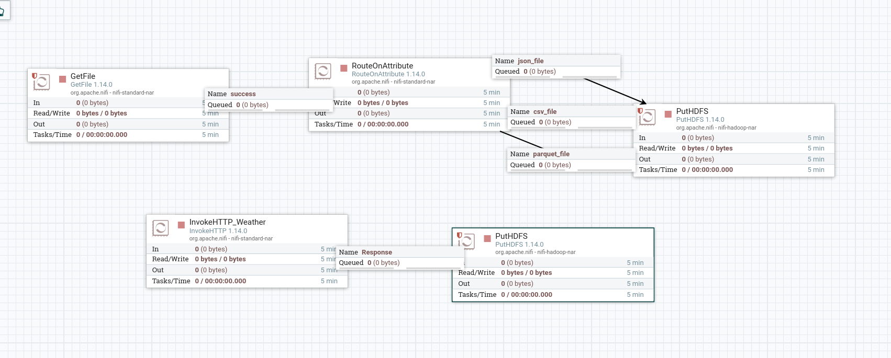
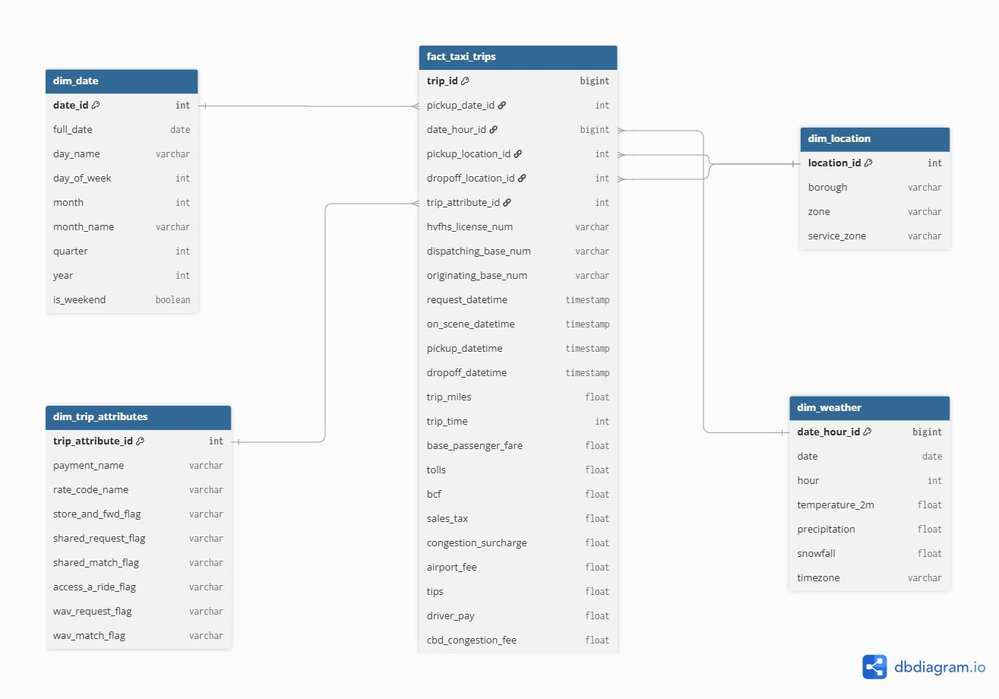

# Airport Flight Booking & Ride-Sharing Analytics Pipeline

## 🚀 Project Overview
An end-to-end Data Engineering and Analytics solution designed for an airport flight booking and ride-sharing platform. This project implements the **Medallion Architecture (Bronze, Silver, Gold)** to ingest, process, store, and analyze large-scale datasets including weather conditions, ride transactions, and payments.

---

## 🏗️ Architecture & Tech Stack
* **Data Ingestion:** Apache NiFi (Batch & API integration)
* **Storage Layer (Data Lake):** HDFS (Hadoop Distributed File System)
* **Processing & ETL:** Apache PySpark & Spark SQL
* **Data Warehousing:** Apache Hive (External Tables, Star Schema)
* **Visualization & Reporting:** Power BI / Analytics Dashboards

---

## 📂 Medallion Architecture & Repository Structure
The project is structured following the core data engineering layers:
* **`bronze/`**: Raw data ingestion logic, NiFi flow XML exports, and initial staging files.
* **`silver/`**: PySpark ETL scripts for data cleaning, type casting, deduplication, and joining ride data with payments to calculate metrics like `net_revenue`.
* **`gold/`**: Business-ready aggregated data, Hive SQL queries, and Data Modeling (Star Schema definitions).

---

## 🔄 Pipeline Workflow
1. **Ingestion (Bronze):** NiFi extracts local datasets and queries the Open-Meteo Weather API, securely routing them to HDFS.
2. **Transformation (Silver):** PySpark handles data standardization, cleans missing values, and implements surge pricing and net revenue logic (`fare_amount - commission`).
3. **Warehousing & Analytics (Gold):** Processed Parquet files are loaded into Hive tables, powering final KPI aggregations (e.g., Average Fare per Trip, P&L analytics).

---

## 📊 System Visuals & Screenshots

### 1. Apache NiFi Ingestion Pipeline

### 2. Data Modeling & Star Schema

---

## 👥 Project Team
* **Mennatullah**(...)
* **Jana** (...)
* **Basel** (...)
* **Bassant** (...)
